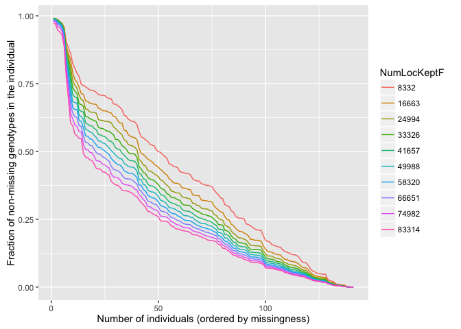
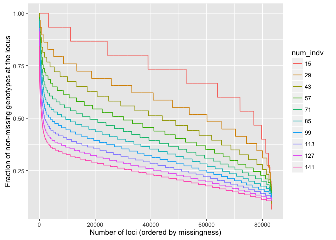

Step-by-step Mykiss
================
11 January, 2017

-   [Introduction](#introduction)
-   [Build bowtie genome data base](#build-bowtie-genome-data-base)
-   [Mapping](#mapping)
-   [Dup-filtering](#dup-filtering)
-   [Merging the Bams](#merging-the-bams)
-   [Indexing the Genome Fasta and creating a dictionary](#indexing-the-genome-fasta-and-creating-a-dictionary)
-   [Calling SNPs with GATK](#calling-snps-with-gatk)
    -   [An experimental run](#an-experimental-run)
    -   [Running it as a job array](#running-it-as-a-job-array)
    -   [Merging SNPs](#merging-snps)
    -   [Filtering SNPs](#filtering-snps)
-   [Missing data visualize with genoscapeRtools](#missing-data-visualize-with-genoscapertools)
-   [A light filtering and then association test](#a-light-filtering-and-then-association-test)
    -   [Assigning Phenotypes as Cases and Controls](#assigning-phenotypes-as-cases-and-controls)
    -   [Running the association analyses](#running-the-association-analyses)
    -   [Extract Indivs and Genos from the original vcf](#extract-indivs-and-genos-from-the-original-vcf)
-   [Re-run everything but use Stacks' `clone_filter`](#re-run-everything-but-use-stacks-clone_filter)

<!-- README.md is generated from README.Rmd. Please edit that file -->
``` r
library(tidyverse)
#> Loading tidyverse: ggplot2
#> Loading tidyverse: tibble
#> Loading tidyverse: tidyr
#> Loading tidyverse: readr
#> Loading tidyverse: purrr
#> Loading tidyverse: dplyr
#> Conflicts with tidy packages ----------------------------------------------
#> filter(): dplyr, stats
#> lag():    dplyr, stats
```

Introduction
------------

We have the data from the Prince et al. study. We have stuff that has already been demultiplexed, etc. Also, the names of the samples are not the same as the names of the files. So, we are going to use modified version of the genoscape-bioinformatics scripts. I am going to store those in the repo, but I will put them into `./mykiss_scripts/`

Build bowtie genome data base
-----------------------------

Simple, one script. Gonna call it omyV6. The first time I did it I think I might not have given it enough time, since bowtie2 never completed when aligning against it later. (And, now that I look over my emails from the cluster, that job was killed). So, this time I have given it 24 hours and we will give it a whirl.

``` sh
[kruegg@login1 Genome]$ pwd
/u/home/k/kruegg/nobackup-klohmuel/Mykiss/Genome
[kruegg@login1 Genome]$ qsub ~/genoscape-bioinformatics/mykiss-scripts/01-bowtie2-build-genome-database.sh  omyV6Chr.fasta  omyV6
JSV: PE=shared
Your job 1397081 ("bowtie2-build-db") has been submitted
[kruegg@login1 Genome]$ date
Tue Dec 27 10:02:16 PST 2016
```

Once that is done, we will try mapping some small bits first, then let it rip in a big job array.

Aha! Done now. And it only took a couple minutes over 1 hour.

Mapping
-------

This is a little different than before because we are going to do it as a job array and we want to only pick certain files out (because mykiss and chinook are all together in one directory), and we are going to want to name the sample with the DNA name, etc. I have all the IDs and the associated file names in the Excel file that Prince et al posted in the supplement on Biorxiv. I copied the text from the relevant sheet in there and then turned that into a text file with the stuff that I needed in it which we will use for the RG tags.

I did this:

``` sh
pbpaste | tr '\r' '\n' | awk 'BEGIN {print "0 ID PU SM PL LB"} NR > 1 {print ++n,$1, $3"."$4, $NF, "ILLUMINA", $4}' > mykiss_ids.txt 
```

and the first few lines of the file look like:

    0 ID PU SM PL LB
    1 SOMM024_NoIndex_AAGACGTGCAGG SOMM024.NoIndex DNAA004_A04 ILLUMINA NoIndex
    2 SOMM024_NoIndex_AAGCTATGCAGG SOMM024.NoIndex DNAA004_A05 ILLUMINA NoIndex
    3 SOMM024_NoIndex_AATATCTGCAGG SOMM024.NoIndex DNAA004_A06 ILLUMINA NoIndex
    4 SOMM024_NoIndex_AATGAGTGCAGG SOMM024.NoIndex DNAA004_A07 ILLUMINA NoIndex
    5 SOMM024_NoIndex_ACATACTGCAGG SOMM024.NoIndex DNAA001_D08 ILLUMINA NoIndex
    6 SOMM024_NoIndex_AGCGCATGCAGG SOMM024.NoIndex DNAA004_B04 ILLUMINA NoIndex
    7 SOMM024_NoIndex_AGGGTCTGCAGG SOMM024.NoIndex DNAA004_B05 ILLUMINA NoIndex

I am saving that in the repo at `./mykiss-scripts/mykiss_ids.txt`.

Now, I write a job-array script that picks out each line, then grabs the appropriate file and aligns it. That script is called `./mykiss-scripts/02-bowtie-map-job-array.sh`. That seems content to run on up to 20 nodes at 2 threads each at a time. So it should finish in just a few hours. The first time I ran it it turns out I hadn't transferred all the data yet, because Kanaloa had barfed while I was scp-ing. So, I finally got all the data, and then I ran the thing like this:

``` sh
[kruegg@login1 Mykiss_all_preps]$ pwd
/u/home/k/kruegg/nobackup-klohmuel/Mykiss/Mykiss_all_preps
[kruegg@login1 Mykiss_all_preps]$ qsub ~/genoscape-bioinformatics/mykiss-scripts/02-bowtie-map-job-array.sh
JSV: PE=shared
Your job-array 1413857.1-242:1 ("radMap") has been submitted
[kruegg@login1 Mykiss_all_preps]$ date
Fri Dec 30 04:56:10 PST 2016
```

Holy Smokes! There must be very little load on hoffman at the moment---all 242 jobs started straight away! (And the whole thing took about half an hour, as far as I can tell.)

Dup-filtering
-------------

I am going to do this as a job array as well, using `samtools rmdup`. There is a little setup for that:

``` sh
[kruegg@n2194 bam]$ pwd
/u/home/k/kruegg/nobackup-klohmuel/Mykiss/Mykiss_all_preps/alignments/omyV6/bam
# break it into 25 chunks of 10 files each
[kruegg@n2194 bam]$ ls -l  *.bam | awk 'NR % 10 == 1 {printf("\n%d ",++n)} {printf(" %s", $NF);} END {printf("\n");}' > bamlist.txt 
[kruegg@n2194 bam]$ head bamlist.txt 

1  SOMM024_NoIndex_AAGACGTGCAGG.bam SOMM024_NoIndex_AAGCTATGCAGG.bam SOMM024_NoIndex_AATATCTGCAGG.bam SOMM024_NoIndex_AATGAGTGCAGG.bam SOMM024_NoIndex_ACATACTGCAGG.bam SOMM024_NoIndex_AGCGCATGCAGG.bam SOMM024_NoIndex_AGGGTCTGCAGG.bam SOMM024_NoIndex_AGGTGTTGCAGG.bam SOMM024_NoIndex_AGTAGGTGCAGG.bam SOMM024_NoIndex_ATCAAATGCAGG.bam
2  SOMM024_NoIndex_CAATCGTGCAGG.bam SOMM024_NoIndex_CACCTCTGCAGG.bam SOMM024_NoIndex_CAGGCATGCAGG.bam SOMM024_NoIndex_CATACTTGCAGG.bam SOMM024_NoIndex_CCATTTTGCAGG.bam SOMM024_NoIndex_CCGAGGTGCAGG.bam SOMM024_NoIndex_CGCGTGTGCAGG.bam SOMM024_NoIndex_CGGTCCTGCAGG.bam SOMM024_NoIndex_CGTCTATGCAGG.bam SOMM024_NoIndex_CGTGATTGCAGG.bam
3  SOMM024_NoIndex_CTACAGTGCAGG.bam SOMM024_NoIndex_CTGGTTTGCAGG.bam SOMM024_NoIndex_GACGACTGCAGG.bam SOMM024_NoIndex_GACTCTTGCAGG.bam SOMM024_NoIndex_GAGAGATGCAGG.bam SOMM024_NoIndex_GATCGTTGCAGG.bam SOMM024_NoIndex_GCAGATTGCAGG.bam SOMM024_NoIndex_GGGCGCTGCAGG.bam SOMM024_NoIndex_GGGGCGTGCAGG.bam SOMM024_NoIndex_GGTACATGCAGG.bam
4  SOMM024_NoIndex_GGTTTGTGCAGG.bam SOMM024_NoIndex_TACACATGCAGG.bam SOMM024_NoIndex_TACGGGTGCAGG.bam SOMM024_NoIndex_TAGTATTGCAGG.bam SOMM024_NoIndex_TATCACTGCAGG.bam SOMM024_NoIndex_TCGATTTGCAGG.bam SOMM024_NoIndex_TGACAATGCAGG.bam SOMM024_NoIndex_TGCCCGTGCAGG.bam SOMM024_NoIndex_TGCTTATGCAGG.bam SOMM024_NoIndex_TGGGGATGCAGG.bam
5  SOMM024_NoIndex_TTCTAGTGCAGG.bam SOMM025_NoIndex_ACCATGTGCAGG.bam SOMM025_NoIndex_ACCCCCTGCAGG.bam SOMM025_NoIndex_ATGCACTGCAGG.bam SOMM025_NoIndex_ATGTTGTGCAGG.bam SOMM025_NoIndex_CCGCATTGCAGG.bam SOMM025_NoIndex_CCTAACTGCAGG.bam SOMM025_NoIndex_CTTATGTGCAGG.bam SOMM025_NoIndex_CTTTGCTGCAGG.bam SOMM025_NoIndex_GCGCTGTGCAGG.bam
6  SOMM025_NoIndex_GCTCAATGCAGG.bam SOMM025_NoIndex_GTGTAATGCAGG.bam SOMM025_NoIndex_GTTGGATGCAGG.bam SOMM025_NoIndex_TCGGACTGCAGG.bam SOMM025_NoIndex_TCTCGGTGCAGG.bam SOMM025_NoIndex_TTTAATTGCAGG.bam SOMM025_NoIndex_TTTGTCTGCAGG.bam SOMM049_Index02_AATATCTGCAGG.bam SOMM049_Index02_AATGAGTGCAGG.bam SOMM049_Index02_AGGTGTTGCAGG.bam
7  SOMM049_Index02_AGTAGGTGCAGG.bam SOMM049_Index02_CATACTTGCAGG.bam SOMM049_Index02_CCATTTTGCAGG.bam SOMM049_Index02_CGTCTATGCAGG.bam SOMM049_Index02_CGTGATTGCAGG.bam SOMM049_Index02_CTACAGTGCAGG.bam SOMM049_Index02_GAGAGATGCAGG.bam SOMM049_Index02_GATCGTTGCAGG.bam SOMM049_Index02_GCAGATTGCAGG.bam SOMM049_Index02_GGTACATGCAGG.bam
8  SOMM049_Index02_GGTTTGTGCAGG.bam SOMM049_Index02_TAGTATTGCAGG.bam SOMM049_Index02_TATCACTGCAGG.bam SOMM049_Index02_TGCTTATGCAGG.bam SOMM049_Index02_TGGGGATGCAGG.bam SOMM050_Index03_AAACGGTGCAGG.bam SOMM050_Index03_AACGTTTGCAGG.bam SOMM050_Index03_AACTGATGCAGG.bam SOMM050_Index03_AAGACGTGCAGG.bam SOMM050_Index03_AAGCTATGCAGG.bam
9  SOMM050_Index03_AATATCTGCAGG.bam SOMM050_Index03_AATGAGTGCAGG.bam SOMM050_Index03_ACAAGATGCAGG.bam SOMM050_Index03_ACAGCGTGCAGG.bam SOMM050_Index03_ACATACTGCAGG.bam SOMM050_Index03_ACCATGTGCAGG.bam SOMM050_Index03_ACCCCCTGCAGG.bam SOMM050_Index03_ACTCTTTGCAGG.bam SOMM050_Index03_ACTGGCTGCAGG.bam SOMM050_Index03_AGCCATTGCAGG.bam
```

And with that done we can launch the job:

``` sh
[kruegg@n2194 bam]$ pwd
/u/home/k/kruegg/nobackup-klohmuel/Mykiss/Mykiss_all_preps/alignments/omyV6/bam
[kruegg@n2194 bam]$ qsub ~/genoscape-bioinformatics/mykiss-scripts/03-rmdup-alignments-job-array.sh 
JSV: PE=shared
Your job-array 1433016.1-25:1 ("rmdup") has been submitted
[kruegg@n2194 bam]$ myjobs
job-ID  prior   name       user         state submit/start at     queue                          slots ja-task-ID 
-----------------------------------------------------------------------------------------------------------------
1432822 0.00208 QRLOGIN    kruegg       r     01/03/2017 13:28:38 inter_msa.q@n2194                  1        
1433016 0.00000 rmdup      kruegg       qw    01/03/2017 14:16:22                                    1 1-25:1
```

That takes about 10 minutes.

Merging the Bams
----------------

We need to merge the deduped bams to prepare for GATK SNP calling. I made a script to to this and I launched it like:

``` sh
[kruegg@n2194 omyV6]$ pwd
/u/home/k/kruegg/nobackup-klohmuel/Mykiss/Mykiss_all_preps/alignments/omyV6
[kruegg@n2194 omyV6]$ qsub ~/genoscape-bioinformatics/mykiss-scripts/04-merge-bams.sh 
JSV: PE=shared
Your job 1433096 ("merge-bams") has been submitted
```

Indexing the Genome Fasta and creating a dictionary
---------------------------------------------------

This is just a small step (takes a couple minutes, tops) that needs to happen before using GATK to call SNPs.

``` sh
# login to a compute node
[kruegg@login3 ~]$ qrsh

# go to the genome
[kruegg@n2168 ~]$ cd nobackup-klohmuel/Mykiss/Genome/
[kruegg@n2168 Genome]$ ls
Annotation              bowtie2-omyV6                                 unmapped_scaffoldsV6.fasta
bowtie2-build-db.error  CIGENEomyV6-genes-longestTranscripts.gff3.gz
bowtie2-build-db.log    omyV6Chr.fasta
[kruegg@n2168 Genome]$ du -h omyV6Chr.fasta 
1.9G    omyV6Chr.fasta

# make a .fai with samtools faidx
[kruegg@n2168 Genome]$ module load samtools
[kruegg@n2168 Genome]$ samtools faidx omyV6Chr.fasta 

# make a dictionary with Picard tools
[kruegg@n2168 Genome]$ PICARD_JAR=/u/nobackup/klohmuel/kruegg/bin/picard.jar
[kruegg@n2168 Genome]$ module load java
[kruegg@n2168 Genome]$ java -jar $PICARD_JAR CreateSequenceDictionary R=omyV6Chr.fasta  O=omyV6Chr.dict
```

Calling SNPs with GATK
----------------------

Now we are ready to go. Because we have put the SM tags into each bam I am hoping that GATK will just call each individual from all of the reads it has across all libraries, seamlessly.

### An experimental run

At the moment, I am logged in to a compute node and I am going to try running this for one chromosome to see what it looks like...

``` sh
[kruegg@n2168 SNP-trial-one]$ pwd
/u/home/k/kruegg/nobackup-klohmuel/Mykiss/Mykiss_all_preps/SNP-trial-one

[kruegg@n2168 SNP-trial-one]$ module load java

[kruegg@n2168 SNP-trial-one]$ GATK_JAR=/u/nobackup/klohmuel/kruegg/bin/GATK-nightly-11-29-16/GenomeAnalysisTK.jar
[kruegg@n2168 SNP-trial-one]$ FASTA=../../Genome/omyV6Chr.fasta
[kruegg@n2168 SNP-trial-one]$ BAM=../alignments/omyV6/MergedBams/omyV6-merged.bam
[kruegg@n2168 SNP-trial-one]$ SEG=" -L omy01 "
[kruegg@n2168 SNP-trial-one]$ OUT=001

[kruegg@n2168 SNP-trial-one]$ java -Xmx4G -jar $GATK_JAR -T HaplotypeCaller \
 -R $FASTA \
 -I $BAM \
 -stand_call_conf 20.0  \
 -o $OUT.vcf --genotyping_mode DISCOVERY \
  $SEG  > $OUT.stdout 2>$OUT.stderr

# now have a look:
[kruegg@n2168 SNP-trial-one]$ cat 001.stderr
.
.
.
INFO  05:33:22,269 ProgressMeter -     omy01:47142              0.0    30.0 s           50.4 w        0.1%    15.0 h      15.0 h 
INFO  05:34:22,334 ProgressMeter -     omy01:47142              0.0    90.0 s          149.7 w        0.1%    45.0 h      45.0 h 
INFO  05:35:22,364 ProgressMeter -    omy01:149793              0.0     2.5 m          249.0 w        0.2%    23.6 h      23.6 h 
INFO  05:36:22,368 ProgressMeter -    omy01:149998              0.0     3.5 m          348.2 w        0.2%    33.0 h      33.0 h 
INFO  05:37:22,376 ProgressMeter -    omy01:195857              0.0     4.5 m          447.4 w        0.2%    32.5 h      32.4 h 
INFO  05:38:22,379 ProgressMeter -    omy01:195857              0.0     5.5 m          546.6 w        0.2%    39.7 h      39.6 h 
INFO  05:39:22,389 ProgressMeter -    omy01:286963              0.0     6.5 m          645.8 w        0.3%    32.0 h      31.9 h 
INFO  05:40:22,400 ProgressMeter -    omy01:340098              0.0     7.5 m          745.1 w        0.4%    31.2 h      31.1 h 
INFO  05:41:22,408 ProgressMeter -    omy01:407906              0.0     8.5 m          844.3 w        0.5%    29.5 h      29.3 h 
INFO  05:42:22,411 ProgressMeter -    omy01:465489              0.0     9.5 m          943.5 w        0.5%    28.9 h      28.7 h 
INFO  05:43:22,418 ProgressMeter -    omy01:520171              0.0    10.5 m         1042.7 w        0.6%    28.6 h      28.4 h 
```

So, that thing is chugging along. Barring any major troubles it looks like it would finish in between 1 and 2 days. So, I will consider running the each chromosome on 4 processors (-nct 4), and I will continue running it at -Xmx4G. I will run these in the default queues that have a 24 hour time limit and hope that it will work.

### Running it as a job array

**Note! I moved all the results of this section to `/u/home/k/kruegg/nobackup-klohmuel/Mykiss/Mykiss_all_preps/SNPs/chromo_pieces` from `SNPs` **

First, I make a tab-delimited file that holds the chromosomes, so I can do it in a job array:

``` sh
[kruegg@n2168 SNPs]$ pwd
/u/home/k/kruegg/nobackup-klohmuel/Mykiss/Mykiss_all_preps/SNPs
[kruegg@n2168 SNPs]$ samtools view -H $BAM | awk 'BEGIN {OFS="\t"} /@SQ/ {print ++n, $2}' | sed 's/SN://g' > chromo_list.txt 
[kruegg@n2168 SNPs]$ cat chromo_list.txt 
1   omy01
2   omy02
3   omy03
4   omy04
5   omy05
6   omy06
7   omy07
8   omy08
9   omy09
10  omy10
11  omy11
12  omy12
13  omy13
14  omy14
15  omy15
16  omy16
17  omy17
18  omy18
19  omy19
20  omy20
21  omy21
22  omy22
23  omy23
24  omy24
25  omy25
26  omy26
27  omy27
28  omy28
29  omy29
```

Then we make a script called `mykiss-scripts/05-call-snps-array.sh`, and we call it like:

``` sh
[kruegg@n2168 SNPs]$ pwd
/u/home/k/kruegg/nobackup-klohmuel/Mykiss/Mykiss_all_preps/SNPs
[kruegg@n2168 SNPs]$ qsub ~/genoscape-bioinformatics/mykiss-scripts/05-call-snps-array.sh
JSV: PE=shared
Your job-array 1436581.1-29:1 ("snp-array") has been submitted
[kruegg@n2168 SNPs]$ date
Wed Jan  4 06:33:40 PST 2017
```

Holy Cow! The first 25 of those started immediately.

Some of these failed with the final statement being:

       WARN  06:34:12,610 PairHMMLikelihoodCalculationEngine$1 - Failed to load native library for VectorLoglessPairHMM - using Java implementation of LOGLESS_CACHING

Aha! Checking the abort messages that get emailed to me, it looks like these guys ended up using too much memory. They crumped out with just over 8Gb. So, I should up each thread to 3 Gb for 12 Gb total and try again... They were 1, 2, 7, 12, 14....so I will restart those.

``` sh
[kruegg@n2168 SNPs]$ pwd
/u/home/k/kruegg/nobackup-klohmuel/Mykiss/Mykiss_all_preps/SNPs
[kruegg@n2168 SNPs]$ rm 001.* 002.* 007.* 012.* 014.*

[kruegg@n2168 SNPs]$ awk 'BEGIN {OFS="\t"} $1==1 || $1==2 || $1==7 || $1==12 || $1==14 {print ++n, $1, $2}' chromo_list.txt > chromo_redos.txt 
[kruegg@n2168 SNPs]$ cat chromo_redos.txt 
1   1   omy01
2   2   omy02
3   7   omy07
4   12  omy12
5   14  omy14
```

Now, I make another script that picks out the line from the first column of chromo\_redos.txt and then creates the output number (like 001) from the second column, and does the -L statement from the 3rd. Call this \``mykiss-scripts/05-call-snps-array-redo.sh`. Try it:

``` sh
[kruegg@n2168 SNPs]$ qsub ~/genoscape-bioinformatics/mykiss-scripts/05-call-snps-array-redo.sh 
JSV: PE=shared
Your job-array 1436659.1-5:1 ("snp-array") has been submitted
[kruegg@n2168 SNPs]$ pwd
/u/home/k/kruegg/nobackup-klohmuel/Mykiss/Mykiss_all_preps/SNPs
[kruegg@n2168 SNPs]$ date
Wed Jan  4 07:26:26 PST 2017
```

That seems to be working now...

### Merging SNPs

That job array got done in less than a day. Now we put all the relevant files into a separate directory called `chromo_pieces` and then merge the files with Picard tools.

``` sh
[kruegg@n2008 chromo_pieces]$ pwd
/u/home/k/kruegg/nobackup-klohmuel/Mykiss/Mykiss_all_preps/SNPs/chromo_pieces
[kruegg@n2008 chromo_pieces]$ PICARD_JAR=/u/nobackup/klohmuel/kruegg/bin/picard.jar
[kruegg@n2008 chromo_pieces]$ INPUTS=$(ls -l 0*.vcf | awk '{printf("I=%s ", $NF)}') 
[kruegg@n2008 chromo_pieces]$ module load java
[kruegg@n2008 chromo_pieces]$ java -jar $PICARD_JAR SortVcf $INPUTS O=full-omyV6.vcf
...
[kruegg@n2008 chromo_pieces]$ du -h full-omyV6.vcf
1.2G    full-omyV6.vcf
```

That takes less than two minutes. So, we only have 1.2G of VCF file.
That seems pretty small to me by comparison to the birds we have done. I moved that to: `/u/nobackup/klohmuel/kruegg/Mykiss/Mykiss_all_preps/SNPs/full-omyV6.vcf`.

### Filtering SNPs

Our filtering criteria:

1.  No indels
2.  Biallelic only
3.  Minor allele frequency &gt; 0.01
4.  minimum genotype quality = 30
5.  minimum depth = 8
6.  called in at least 10% of indivs

We only require it be called in 10% of individuals because when I required 50% we got &lt;1000 sites. So, let's do that:

``` sh
[kruegg@n2008 SNPs]$ module load vcftools
[kruegg@n2008 SNPs]$ vcftools --vcf full-omyV6.vcf --out full-omyV6-filtered  --remove-indels --min-alleles 2 --max-alleles 2 --maf 0.01  --minGQ 30 --minDP 8 --max-missing 0.1 --recode
```

This yields 83,314 sites.

No wonder they use ANGSD---their data quality if crapola!

So, let's make an 012 file

    [kruegg@n2008 SNPs]$ vcftools --vcf full-omyV6-filtered.recode.vcf --out full-omyV6-filtered --012

And I will bring that to my laptop:

    /Users/eriq/Documents/UnsyncedData/Mykiss/full-omyV6-filtered.012.gz
    /Users/eriq/Documents/UnsyncedData/Mykiss/full-omyV6-filtered.012.indv
    /Users/eriq/Documents/UnsyncedData/Mykiss/full-omyV6-filtered.012.pos

Missing data visualize with genoscapeRtools
-------------------------------------------

Let's have a look at how we are doing here:

``` r
library(genoscapeRtools)

mykiss <- read_012("~/Documents/UnsyncedData/Mykiss/full-omyV6-filtered", gz = TRUE)

indv <- miss_curves_indv(mykiss)
indv$plot
```

 Wow! That is serious gargbage!

How about at the pos level?

``` r
loci <- miss_curves_locus(mykiss)
loci$plot
```



Gee, I have never seen data look so bad. If you want to see what things should look like with good data (Kristen's Zosterops data) check it out [here](https://github.com/eriqande/genoscapeRtools#doing-the-missing-data-calcs).

I think I shall have to run through everything using Stacks' `clone_filter` (what we used with Zosterops) instead of using `samtools rmdup` to see if that gives any different results.

A light filtering and then association test
-------------------------------------------

I do a super light filter:

     vcftools --vcf full-omyV6.vcf --out light  --remove-indels --min-alleles 2 --max-alleles 2 --maf 0.05  --max-missing 0.1 --recode

Which gives me about 250K SNPs which is in the ballpark of the 215K "Super high quality" ones that Mike claims. So, let's bring that to my laptop and then plink around with it:

    # recode it into a plink file.  Be sure to double the IDs---otherwise it breaks them on the underscores.
    2017-01-11 05:16 /Mykiss/--% pwd
    /Users/eriq/Documents/UnsyncedData/Mykiss
    2017-01-11 05:17 /Mykiss/--% plink --vcf light.recode.vcf.gz --aec --make-bed  --out mykiss-full-light --double-id

Then filter that down even more. Toss individuals with more than 70% missing data and loci that are missing in more than 50% of the individuals. This gets me down to about 127K markers in 121 indivs:

    2017-01-11 05:18 /Mykiss/--% plink --bfile mykiss-full-light --aec --mind 0.7 --geno 0.5   --make-bed --out mykiss-127K-121
    PLINK v1.90b3.42 64-bit (20 Sep 2016)      https://www.cog-genomics.org/plink2
    (C) 2005-2016 Shaun Purcell, Christopher Chang   GNU General Public License v3
    Logging to mykiss-127K-121.log.
    Options in effect:
      --allow-extra-chr
      --bfile mykiss-full-light
      --geno 0.5
      --make-bed
      --mind 0.7
      --out mykiss-127K-121

    4096 MB RAM detected; reserving 2048 MB for main workspace.
    248455 variants loaded from .bim file.
    141 people (0 males, 0 females, 141 ambiguous) loaded from .fam.
    Ambiguous sex IDs written to mykiss-127K-121.nosex .
    20 people removed due to missing genotype data (--mind).
    IDs written to mykiss-127K-121.irem .
    Using 1 thread (no multithreaded calculations invoked).
    Before main variant filters, 121 founders and 0 nonfounders present.
    Calculating allele frequencies... done.
    Total genotyping rate in remaining samples is 0.534269.
    120840 variants removed due to missing genotype data (--geno).
    127615 variants and 121 people pass filters and QC.
    Note: No phenotypes present.
    --make-bed to mykiss-127K-121.bed + mykiss-127K-121.bim + mykiss-127K-121.fam
    ... done.

That will be what I work from: `/Users/eriq/Documents/UnsyncedData/Mykiss/mykiss-127K-121.*`

### Assigning Phenotypes as Cases and Controls

We are going to do a separate association test for the Umpqua and another for the Eel. We need to figure out which IDs we need. This is a job for R:

``` r
# read in the meta data
mykiss_meta <- readxl::read_excel(path = "../../mykiss-scripts/other_inputs/mykiss_meta.xls", sheet = 1)

# whittle it down to eel and umpqua
eel_all <- mykiss_meta %>%
  filter(Location == "Eel River")
umpqua_all <- mykiss_meta %>%
  filter(Location == "North Umpqua River")

# get a list of the individuals we have retained from the genomic data
retained <- read_delim("/Users/eriq/Documents/UnsyncedData/Mykiss/mykiss-127K-121.fam", col_names = FALSE, delim = " ") %>%
  select(X1) %>%
  unlist() %>% unname()
#> Parsed with column specification:
#> cols(
#>   X1 = col_character(),
#>   X2 = col_character(),
#>   X3 = col_integer(),
#>   X4 = col_integer(),
#>   X5 = col_integer(),
#>   X6 = col_integer()
#> )

# then pick out only those retained indivs for each pop
eel_retained <- eel_all %>%
  filter(`Sample DNA ID` %in% retained)
umpqua_retained <- umpqua_all %>%
  filter(`Sample DNA ID` %in% retained)

# now make some whitelists to pick those individuals out and some case/control lists.
# we are going to designate the prematures as "cases"
cat(eel_retained$`Sample DNA ID`, sep = "\n", file = "~/Documents/UnsyncedData/Mykiss/lists/eel_keep.txt")
cat(umpqua_retained$`Sample DNA ID`, sep = "\n", file = "~/Documents/UnsyncedData/Mykiss/lists/umpqua_keep.txt")

eel_retained %>%
  filter(`Migration Category` == "Premature") %>%
  mutate(a1 = `Sample DNA ID`, a2 = `Sample DNA ID`) %>%
  select(a1, a2) %>% 
  write.table(., quote = F, sep = " ", row.names = F, col.names = F, file = "~/Documents/UnsyncedData/Mykiss/lists/eel_cases.txt")

umpqua_retained %>%
  filter(`Migration Category` == "Premature") %>%
  mutate(a1 = `Sample DNA ID`, a2 = `Sample DNA ID`) %>%
  select(a1, a2) %>% 
  write.table(., quote = F, sep = " ", row.names = F, col.names = F, file = "~/Documents/UnsyncedData/Mykiss/lists/umpqua_cases.txt")
```

### Running the association analyses

First we make a file of umpqua and eel fish:

``` sh
2017-01-11 05:59 /Mykiss/--% pwd
/Users/eriq/Documents/UnsyncedData/Mykiss
2017-01-11 05:59 /Mykiss/--% plink -bfile mykiss-127K-121 --keep-fam lists/eel_keep.txt --make-bed --out eel --aec
2017-01-11 05:59 /Mykiss/--% plink -bfile mykiss-127K-121 --keep-fam lists/umpqua_keep.txt --make-bed --out umpqua --aec
```

#### Eel

Then, let's run a quick association test on eel:

``` sh
2017-01-11 06:16 /Mykiss/--% pwd
/Users/eriq/Documents/UnsyncedData/Mykiss
2017-01-11 06:16 /Mykiss/--% plink -bfile eel  --aec --make-pheno lists/eel_cases.txt '*'  --assoc fisher --out eel_ass --allow-no-sex
```

and have a look at that

``` r
# readr's read_table barfs on this somehow!
eel_ass <- read.table("~/Documents/UnsyncedData/Mykiss/eel_ass.assoc.fisher", header=T, stringsAsFactors = F)
arrange(eel_ass, P) %>%
  head(n=20)
#>      CHR SNP       BP A1     F_A     F_U A2         P        OR
#> 1  omy28   . 11667915  G 0.04348 1.00000  A 2.206e-18  0.000000
#> 2  omy28   . 11667773  C 0.04762 1.00000  T 1.556e-17  0.000000
#> 3  omy28   . 11667954  A 0.06522 1.00000  G 2.280e-17  0.000000
#> 4  omy28   . 11609825  C 0.05882 1.00000  T 1.288e-13  0.000000
#> 5  omy28   . 11668031  C 0.04762 1.00000  A 1.913e-12  0.000000
#> 6  omy28   . 11613335  T 0.04545 1.00000  G 1.183e-11  0.000000
#> 7  omy28   . 11613402  G 0.04545 1.00000  A 1.183e-11  0.000000
#> 8  omy09   . 24689141  T 0.76470 0.00000  C 3.828e-11        NA
#> 9  omy28   . 11667682  T 0.00000 1.00000  A 9.043e-11  0.000000
#> 10 omy25   . 61217332  C 0.17390 0.90000  T 2.010e-10  0.023390
#> 11 omy28   . 11384594  T 0.10870 0.80000  C 1.016e-09  0.030490
#> 12 omy08   . 27834312  A 0.13330 0.95450  G 1.569e-09  0.007326
#> 13 omy05   . 27799832  A 0.03571 1.00000  C 2.327e-09  0.000000
#> 14 omy01   . 52663649  A 0.16670 1.00000  C 4.603e-09  0.000000
#> 15 omy28   .  8516469  T 0.00000 0.61540  C 6.210e-09  0.000000
#> 16 omy25   . 71388201  T 0.07895 0.79170  C 1.067e-08  0.022560
#> 17 omy04   . 40832954  T 0.63040 0.03125  C 1.795e-08 52.880000
#> 18 omy08   . 43248763  A 0.00000 0.56250  G 2.032e-08  0.000000
#> 19 omy01   . 51241613  C 0.16670 0.81250  A 2.433e-08  0.046150
#> 20 omy27   .  1579646  T 0.70590 0.00000  G 3.260e-08        NA
```

Whoop! There they are!

#### Umpqua

Same drill:

``` sh
2017-01-11 06:32 /Mykiss/--% plink -bfile umpqua  --aec --make-pheno lists/umpqua_cases.txt '*'  --assoc fisher --out ump_ass --allow-no-sex
```

and have a look at that

``` r
# for some reason read_table doesn't correctly read the scientific notation...
ump_ass <- read.table("~/Documents/UnsyncedData/Mykiss/ump_ass.assoc.fisher", header=T, stringsAsFactors = F) %>%
  tbl_df
arrange(ump_ass, P) %>%
  head(n=20)
#> # A tibble: 20 x 9
#>      CHR   SNP       BP    A1     F_A     F_U    A2         P        OR
#>    <chr> <chr>    <int> <chr>   <dbl>   <dbl> <chr>     <dbl>     <dbl>
#> 1  omy28     . 11667915     A 1.00000 0.06522     G 9.257e-21        NA
#> 2  omy28     . 11667954     G 1.00000 0.06522     A 9.257e-21        NA
#> 3  omy28     . 11613335     T 0.00000 0.89470     G 3.248e-17 0.000e+00
#> 4  omy28     . 11613402     G 0.00000 0.89470     A 3.248e-17 0.000e+00
#> 5  omy28     . 11609825     T 1.00000 0.07895     C 3.052e-16        NA
#> 6  omy28     . 11667837     T 0.94440 0.09091     A 9.555e-16 1.700e+02
#> 7  omy28     . 11668031     C 0.00000 0.87500     A 3.607e-15 0.000e+00
#> 8  omy28     . 11667682     T 0.00000 0.92310     A 7.463e-14 0.000e+00
#> 9  omy28     . 11589054     C 0.06250 0.90620     T 2.787e-12 6.897e-03
#> 10 omy28     . 11667773     T 0.83330 0.08696     C 2.795e-12 5.250e+01
#> 11 omy28     . 11803846     T 0.02632 0.73910     G 2.910e-12 9.539e-03
#> 12 omy28     . 11613233     G 0.00000 0.85000     A 2.418e-11 0.000e+00
#> 13 omy28     . 11613481     A 0.00000 0.79170     C 4.487e-11 0.000e+00
#> 14 omy28     . 11613427     T 0.00000 0.88460     A 8.483e-11 0.000e+00
#> 15 omy28     . 11613225     C 0.00000 0.80000     T 2.297e-10 0.000e+00
#> 16 omy28     . 11803870     C 0.02632 0.65220     T 4.830e-10 1.441e-02
#> 17 omy28     . 11985747     T 0.73330 0.05000     C 1.325e-09 5.225e+01
#> 18 omy28     . 11613146     G 0.00000 0.85710     A 2.339e-09 0.000e+00
#> 19 omy28     . 12179107     T 0.77780 0.10530     G 3.912e-09 2.975e+01
#> 20 omy28     . 11609793     A 0.00000 0.52170     G 1.341e-08 0.000e+00
```

And those things look like they correspond to what Mike found. Good.

### Extract Indivs and Genos from the original vcf

I am curious about how much data (how many reads, etc) we actually have at these positions. Let's just take the top 20 positions from each species and then take the intersection of those.

``` r
hi_rollers <- list(
  umpqua = head(arrange(ump_ass, P), n = 20),
  eel = head(arrange(eel_ass, P), n = 20)) %>%
  bind_rows(.id = "pop")

# write out the CHROM and POS that we wish to extract
hi_rollers %>%
  group_by(CHR, BP) %>%
  tally() %>%
  filter(n == 2) %>%
  select(CHR, BP) %>%
  write.table(., row.names = F, col.names = F, quote = F, file = "outputs/shared_assoc_snps.txt", sep = "\t")

# and also get the indivs that we used
cat(c(eel_retained$`Sample DNA ID`, umpqua_retained$`Sample DNA ID`), sep = "\n", file = "outputs/assoc_study_ids.txt")
```

and then get that with vcftools

``` sh
2017-01-11 13:45 /Mykiss/--% vcftools --gzvcf light.recode.vcf.gz --keep ~/Documents/git-repos/genoscape-bioinformatics/user-notes/eric-anderson/outputs/assoc_study_ids.txt --positions  ~/Documents/git-repos/genoscape-bioinformatics/user-notes/eric-anderson/outputs/shared_assoc_snps.txt --recode --out shared-assoc-8-snps
```

And then we can read that with vcfR

``` r
library(vcfR)
#> 
#>    *****       ***   vcfR   ***       *****
#>    This is vcfR 1.4.0 
#>      browseVignettes('vcfR') # Documentation
#>      citation('vcfR') # Citation
#>    *****       *****      *****       *****

vcf <- read.vcfR("~/Documents/UnsyncedData/Mykiss/shared-assoc-8-snps.recode.vcf")
#> 
Meta line 56 read in.
#> All meta lines processed.
#> Character matrix gt created.
#> Character matrix gt rows: 8
#> Character matrix gt cols: 91
#> skip: 0
#> nrows: 8
#> row_num: 0
#> 
#> 
Processed variant: 8
#> All variants processed

tmp <- vcfR2tidy(vcf, single_frame = TRUE)
#> Extracting gt element AD
#> Extracting gt element DP
#> Extracting gt element GQ
#> Extracting gt element GT
#> Extracting gt element PL
genos <- tmp$dat %>%
  select(-ID, -(FILTER:SOR))  %>%
  left_join(., mykiss_meta, by = c(Indiv = "Sample DNA ID")) %>%
  select(CHROM:gt_GT_alleles,`Migration Category`, everything())

# and write those to an output file
write_csv(genos, path = "outputs/assoc-snps-info.csv")
```

Re-run everything but use Stacks' `clone_filter`
------------------------------------------------

This is less relevant, since I found the association with the data filtered with samtools.

OK, I am going to make some job-array versions of these. I have the mykiss IDs, but I am going to want to send these jobs off with about 10 files at a time, so I will make a new file that has the file name prefixes, 10 to a line:

``` sh
2017-01-06 06:31 /mykiss-scripts/--% (master) pwd
/Users/eriq/Documents/git-repos/genoscape-bioinformatics/mykiss-scripts
2017-01-06 06:31 /mykiss-scripts/--% (master) cat mykiss_ids.txt | awk '$1 % 10 == 1 {printf("\n%d ",++n)} {printf(" %s", $2);} END {printf("\n");}' > mykiss_files_in_25_rows.txt 
```

That makes the file `mykiss_files_in_25_rows.txt` that looks like:

    2017-01-06 06:35 /mykiss-scripts/--% (master) head -5 mykiss_files_in_25_rows.txt 
     ID
    1  SOMM024_NoIndex_AAGACGTGCAGG SOMM024_NoIndex_AAGCTATGCAGG SOMM024_NoIndex_AATATCTGCAGG SOMM024_NoIndex_AATGAGTGCAGG SOMM024_NoIndex_ACATACTGCAGG SOMM024_NoIndex_AGCGCATGCAGG SOMM024_NoIndex_AGGGTCTGCAGG SOMM024_NoIndex_AGGTGTTGCAGG SOMM024_NoIndex_AGTAGGTGCAGG SOMM024_NoIndex_ATCAAATGCAGG
    2  SOMM024_NoIndex_CAATCGTGCAGG SOMM024_NoIndex_CACCTCTGCAGG SOMM024_NoIndex_CAGGCATGCAGG SOMM024_NoIndex_CATACTTGCAGG SOMM024_NoIndex_CCATTTTGCAGG SOMM024_NoIndex_CCGAGGTGCAGG SOMM024_NoIndex_CGCGTGTGCAGG SOMM024_NoIndex_CGGTCCTGCAGG SOMM024_NoIndex_CGTCTATGCAGG SOMM024_NoIndex_CGTGATTGCAGG
    3  SOMM024_NoIndex_CTACAGTGCAGG SOMM024_NoIndex_CTGGTTTGCAGG SOMM024_NoIndex_GACGACTGCAGG SOMM024_NoIndex_GACTCTTGCAGG SOMM024_NoIndex_GAGAGATGCAGG SOMM024_NoIndex_GATCGTTGCAGG SOMM024_NoIndex_GCAGATTGCAGG SOMM024_NoIndex_GGGCGCTGCAGG SOMM024_NoIndex_GGGGCGTGCAGG SOMM024_NoIndex_GGTACATGCAGG
    4  SOMM024_NoIndex_GGTTTGTGCAGG SOMM024_NoIndex_TACACATGCAGG SOMM024_NoIndex_TACGGGTGCAGG SOMM024_NoIndex_TAGTATTGCAGG SOMM024_NoIndex_TATCACTGCAGG SOMM024_NoIndex_TCGATTTGCAGG SOMM024_NoIndex_TGACAATGCAGG SOMM024_NoIndex_TGCCCGTGCAGG SOMM024_NoIndex_TGCTTATGCAGG SOMM024_NoIndex_TGGGGATGCAGG

Now, we make the script `/mykiss-scripts/cf-01-clone-filter.sh` to use that in a job array. We call it with the 25-line file and the name of the output directory we want.

``` sh
[kruegg@n2236 RAD_sequence]$ pwd
/u/home/k/kruegg/nobackup-klohmuel/Mykiss/Prince_etal_raw/RAD_sequence
[kruegg@n2236 RAD_sequence]$ mkdir ../../Mykiss_all_preps/clone_filtered/

[kruegg@n2236 RAD_sequence]$ qsub ~/genoscape-bioinformatics/mykiss-scripts/cf-01-clone-filter.sh ~/genoscape-bioinformatics/mykiss-scripts/mykiss_files_in_25_rows.txt  ../../Mykiss_all_preps/clone_filtered
JSV: PE=shared
Your job-array 1444235.1-25:1 ("clone_filter") has been submitted
[kruegg@n2236 RAD_sequence]$ date
Fri Jan  6 07:06:00 PST 2017
```

That took about 27 minutes total.
