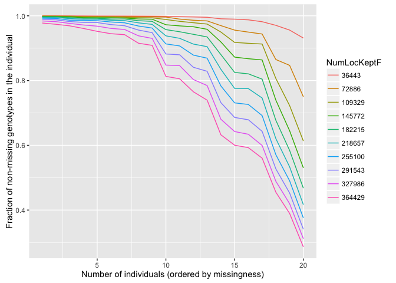
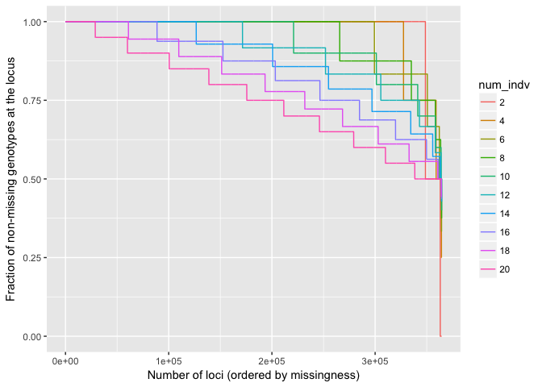
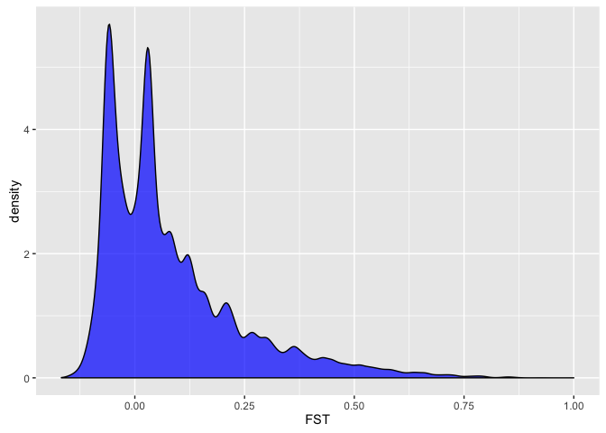
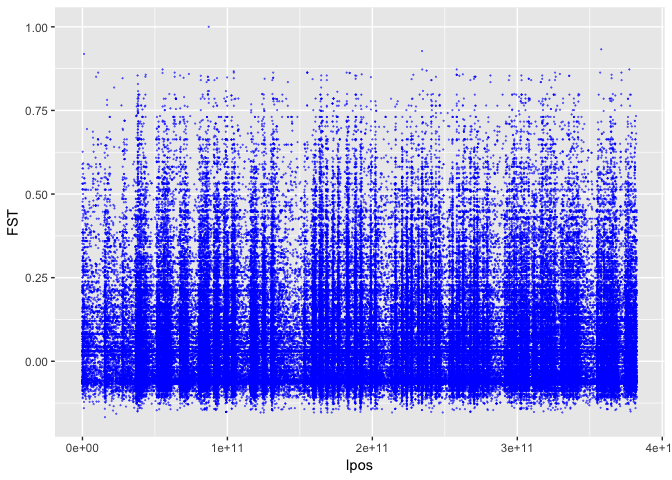

Processing *Zosterops* 20 birds after the bioinformatics
================
18 November, 2016

-   [Introduction](#introduction)
-   [Plinking around](#plinking-around)

<!-- README.md is generated from README.Rmd. Please edit that file -->
Introduction
------------

First, get it here:

``` sh
2016-11-18 04:00 /ZOLA/--% pwd
/Users/eriq/Documents/UnsyncedData/ZOLA
2016-11-18 04:00 /ZOLA/--% scp  kruegg@hoffman2.idre.ucla.edu:/u/home/k/kruegg/nobackup-klohmuel/ZOLA/SNPs/zola-twenty-filt.012.*  ./ 
```

Then we are going to do some further filtering for missing data

``` r
library(genoscapeRtools)
library(dplyr)
#> 
#> Attaching package: 'dplyr'
#> The following objects are masked from 'package:stats':
#> 
#>     filter, lag
#> The following objects are masked from 'package:base':
#> 
#>     intersect, setdiff, setequal, union
library(readr)
library(ggplot2)
zola <- read_012("~/Documents/UnsyncedData/ZOLA/zola-twenty-filt", gz = TRUE)
```

And then we want to look at patterns of missing data

``` r
indv <- miss_curves_indv(zola)
locs <- miss_curves_locus(zola)
```

Here are the two plots.

By indiv:

``` r
indv$plot
```



and by locus:

``` r
locs$plot
```



OK, that looks good. I am going to retain 17 individuals and 180K markers.

``` r
clean <- miss_curves_indv(zola, clean_pos = 180000, clean_indv = 17)
#> Picking out clean_pos and clean_indv and writing them to cleaned_indv17_pos180000.012
```

Now we need to pick those out of the original VCF and bring that back

``` sh
2016-11-18 04:37 /eric-anderson/--% (master) scp cleaned_indv17_pos180000.012.* kruegg@hoffman2.idre.ucla.edu:/u/home/k/kruegg/nobackup-klohmuel/ZOLA/SNPs/

# then on hoffman:
[kruegg@n2239 SNPs]$ vcftools --vcf zola-twenty-filtered.recode.vcf --keep cleaned_indv17_pos180000.012.indv  --positions cleaned_indv17_pos180000.012.pos  --out zola-twenty-17-180K --recode
[kruegg@n2239 SNPs]$ mv zola-twenty-17-180K.recode.vcf zola-twenty-17-180K.vcf
[kruegg@n2239 SNPs]$ gzip -9 zola-twenty-17-180K.vcf 

# and then back on my laptop
2016-11-18 04:45 /ZOLA/--% scp  kruegg@hoffman2.idre.ucla.edu:/u/home/k/kruegg/nobackup-klohmuel/ZOLA/SNPs/zola-twenty-17-180K.vcf.gz ./ 

# and finally plink-ize it:
2016-11-18 04:46 /ZOLA/--% plink --vcf zola-twenty-17-180K.vcf.gz --make-bed --out clean-zola --aec --double-id
PLINK v1.90b3.42 64-bit (20 Sep 2016)      https://www.cog-genomics.org/plink2
(C) 2005-2016 Shaun Purcell, Christopher Chang   GNU General Public License v3
Logging to clean-zola.log.
Options in effect:
  --allow-extra-chr
  --double-id
  --make-bed
  --out clean-zola
  --vcf zola-twenty-17-180K.vcf.gz

4096 MB RAM detected; reserving 2048 MB for main workspace.
--vcf: clean-zola-temporary.bed + clean-zola-temporary.bim +
clean-zola-temporary.fam written.
180000 variants loaded from .bim file.
17 people (0 males, 0 females, 17 ambiguous) loaded from .fam.
Ambiguous sex IDs written to clean-zola.nosex .
Using 1 thread (no multithreaded calculations invoked).
Before main variant filters, 17 founders and 0 nonfounders present.
Calculating allele frequencies... done.
Total genotyping rate is 0.949068.
180000 variants and 17 people pass filters and QC.
Note: No phenotypes present.
--make-bed to clean-zola.bed + clean-zola.bim + clean-zola.fam ... done.
```

Plinking around
---------------

First let's look at the IDs:

``` sh
2016-11-18 04:53 /ZOLA/--% cat clean-zola.fam 
12-051 12-051 0 0 0 -9
12-052 12-052 0 0 0 -9
12-053 12-053 0 0 0 -9
12-061 12-061 0 0 0 -9
12-064 12-064 0 0 0 -9
12-066 12-066 0 0 0 -9
12-068 12-068 0 0 0 -9
CDH16 CDH16 0 0 0 -9
CDH18 CDH18 0 0 0 -9
CDH20 CDH20 0 0 0 -9
CDH22 CDH22 0 0 0 -9
CDH23 CDH23 0 0 0 -9
CDH24 CDH24 0 0 0 -9
CDH46 CDH46 0 0 0 -9
CDH48 CDH48 0 0 0 -9
CDH49 CDH49 0 0 0 -9
CDH50 CDH50 0 0 0 -9
```

Unfortunately, the 3 individual we dropped were all from Heron Island. So, we are going to have 7 from Heron Island and 10 from the mainland. We are going to make a file that says which clusters/groups these birds are in:

``` sh
2016-11-18 05:07 /ZOLA/--% awk '{pop = "ML"} NR<=7 {pop = "HE";} {printf("%s\t%s\t%s\n",$1,$2,pop);}' clean-zola.fam > clean-zola.pops
2016-11-18 05:08 /ZOLA/--% cat clean-zola.pops 
12-051  12-051  HE
12-052  12-052  HE
12-053  12-053  HE
12-061  12-061  HE
12-064  12-064  HE
12-066  12-066  HE
12-068  12-068  HE
CDH16   CDH16   ML
CDH18   CDH18   ML
CDH20   CDH20   ML
CDH22   CDH22   ML
CDH23   CDH23   ML
CDH24   CDH24   ML
CDH46   CDH46   ML
CDH48   CDH48   ML
CDH49   CDH49   ML
CDH50   CDH50   ML
```

So, HE = Heron Island and ML = Mainland.

Now run some quick analyses

``` sh
2016-11-18 05:18 /ZOLA/--% plink --bfile clean-zola --aec --within clean-zola.pops --keep-cluster-names HE --out HE --hardy --freqx
2016-11-18 05:18 /ZOLA/--% plink --bfile clean-zola --aec --within clean-zola.pops --keep-cluster-names ML --out ML --hardy --freqx
2016-11-18 05:21 /ZOLA/--% plink --bfile clean-zola --aec --within clean-zola.pops --out HE-ML --fst
```

And we can load that and look at the Fst's

``` r
fst <- read_delim("~/Documents/UnsyncedData/ZOLA/HE-ML.fst", delim = "\t")
#> Parsed with column specification:
#> cols(
#>   CHR = col_character(),
#>   SNP = col_character(),
#>   POS = col_integer(),
#>   NMISS = col_integer(),
#>   FST = col_double()
#> )
```

``` r
ggplot(fst, aes(x = FST)) +
  geom_density(fill = "blue", alpha = 0.7)
#> Warning: Removed 314 rows containing non-finite values (stat_density).
```



Now, we don't have these things mapped to a complete genome, but for now we can just spooge them out in scaffold order (pretending that they all just get stiched together)

``` r
fst2 <- fst %>%
  mutate(lpos = cumsum(as.numeric(POS)))
ggplot(fst2, aes(x = lpos, y = FST)) +
  geom_point(size = 0.07, colour = "blue", alpha = 0.5)
#> Warning: Removed 314 rows containing missing values (geom_point).
```

 There doesn't seem to be a whole lot going on there. But we might need more complete samples.
